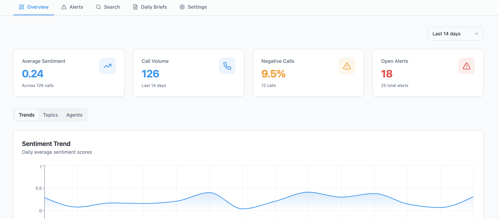
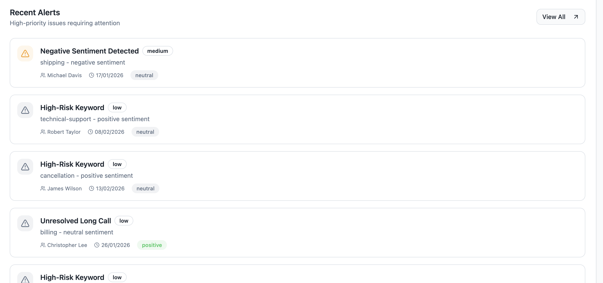
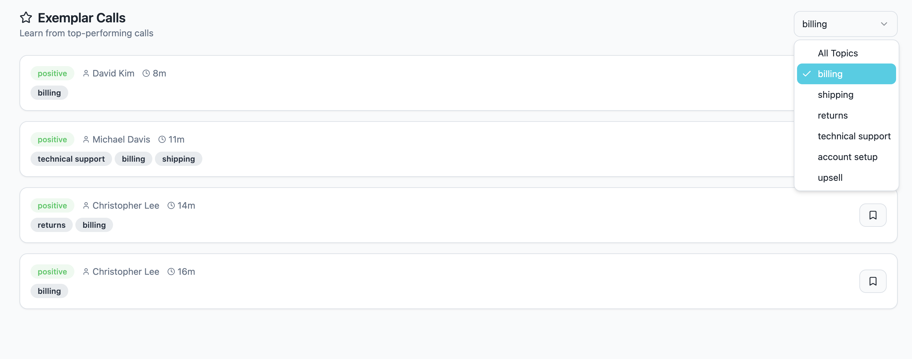
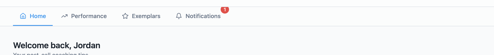

Supervisor

Icons ("Average Sentiment, Call volume, Negative calls, Open Alerts) hover but dont lead to anything. I think the agent user should be able to go into each from here.

Already has the "view all" option, so when i tap on an alert it should open the alert not the alerts page. Some icons hover e.g "positive" others don't

Agents

Make the agent able to select various topics to filter, instead of just one

Notification cuts off
