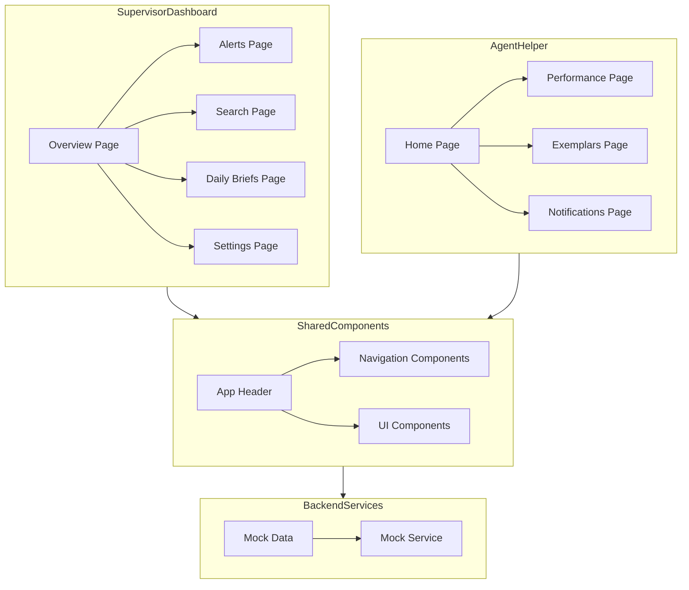

    

    <b>Automatic Architecture Diagrams from Code</b> 
    <a href="https://github.com/swark-io/swark">GitHub</a> • <a href="https://swark.io">Website</a> • <a href="mailto:contact@swark.io">Contact Us</a>

## Usage Instructions

1. **Render the Diagram**: Use the links below to open it in Mermaid Live Editor, or install the [Mermaid Support](https://marketplace.visualstudio.com/items?itemName=bierner.markdown-mermaid) extension.
2. **Recommended Model**: If available for you, use `claude-3.5-sonnet` [language model](vscode://settings/swark.languageModel). It can process more files and generates better diagrams.
3. **Iterate for Best Results**: Language models are non-deterministic. Generate the diagram multiple times and choose the best result.

## Generated Content
**Model**: GPT-4o - [Change Model](vscode://settings/swark.languageModel)  
**Mermaid Live Editor**: [View](https://mermaid.live/view#pako:eNp1U01vgzAM_StRzu0f4DCpHZPaw7ZKrKfQgwsGokKCksBWVf3vCw3QwNgB8uxn-9n5uNFEpkgDGotcQV2QrzAWhOjm7MyoqVG1XEsVgi7OElTa8YR8tp0fv9kAyAFyPDlyU6IymrnFJyIElRTMLT6xVRwzzULg5bU3pnnGcJFrNgCfHDtYr1966QXCaS4QTm0xw2l1FAo792RnNjkKs8PS7o_L3ckKWffzezugyqSqQCTIPOyHvP1gVZegNBuRT39IwzOegOFSaDax_LCHcNe1pzJjxvIz_6Tm8rBRAQrTV1nVUtix-wqbut4hpKiYRcTBoWtomf14_qhKnpk9f9w_Xey4_xsw1nYtQrvk9qssN76F5GK9UXesCfZ9v8vkEoIB1gHSodOT6EMd1xunad5D24udSC-8GHebFrbQu0P_xsx97s7Ox6IrWqE9dZ7at3yLqSmwwpgGJKYpZtCUJqZ3G9TUKRgMOdjtqWhgVIMrCo2R0VUkg61kkxc0yKDUeP8FqBdqpA) | [Edit](https://mermaid.live/edit#pako:eNp1U01vgzAM_StRzu0f4DCpHZPaw7ZKrKfQgwsGokKCksBWVf3vCw3QwNgB8uxn-9n5uNFEpkgDGotcQV2QrzAWhOjm7MyoqVG1XEsVgi7OElTa8YR8tp0fv9kAyAFyPDlyU6IymrnFJyIElRTMLT6xVRwzzULg5bU3pnnGcJFrNgCfHDtYr1966QXCaS4QTm0xw2l1FAo792RnNjkKs8PS7o_L3ckKWffzezugyqSqQCTIPOyHvP1gVZegNBuRT39IwzOegOFSaDax_LCHcNe1pzJjxvIz_6Tm8rBRAQrTV1nVUtix-wqbut4hpKiYRcTBoWtomf14_qhKnpk9f9w_Xey4_xsw1nYtQrvk9qssN76F5GK9UXesCfZ9v8vkEoIB1gHSodOT6EMd1xunad5D24udSC-8GHebFrbQu0P_xsx97s7Ox6IrWqE9dZ7at3yLqSmwwpgGJKYpZtCUJqZ3G9TUKRgMOdjtqWhgVIMrCo2R0VUkg61kkxc0yKDUeP8FqBdqpA)

