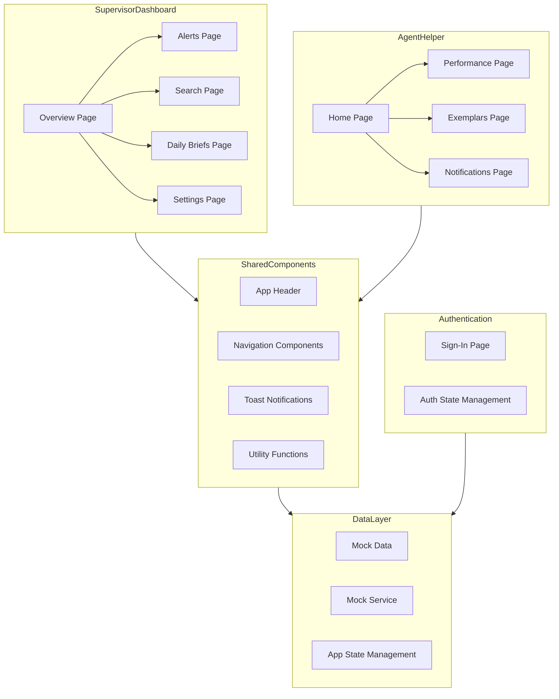

# Project Reset Report

**Project:** Amazon Connect Agent Supervisor Insights
**Date:** February 3, 2026
**Team:** AWS Minority Business Support 4 (Team 5)

## Architecture Diagram

## Architecture Explanation

The system is currently a client-only React application with two primary user experiences: a **Supervisor Dashboard** (overview, alerts, search, briefs, settings) and an **Agent Helper** (home, performance, exemplars, notifications). Both areas depend on shared UI components and utilities. State is managed via a centralized app store and auth store, and all data is supplied by a mock data layer (`MockData` + `MockService`) that simulates backend behavior. Authentication is also mocked client-side, and data persistence relies on local storage. There is no backend API, service abstraction, or production authentication layer yet, so the end-to-end flow is entirely in-browser.

## Technical Debt & Risk List (Summary)

**Critical**
- **TD-01 Mock-only data layer**: UI is tightly coupled to mock services; no path to real API integration. High impact on backend/production readiness.
- **TD-02 Mock authentication**: Hardcoded users, localStorage sessions, and client-only route guards. High security and compliance risk.
- **TD-03 No automated tests**: Zero test coverage; refactors are unsafe and regressions are likely.
- **R-02 Security & privacy risks**: Unsanitized inputs, localStorage secrets, CSV injection risk, and future PII/AI data leakage concerns.

**High**
- **TD-04 TypeScript strict mode disabled**: Weak type safety increases runtime error risk and slows refactoring.
- **R-01 AI hallucination risk**: Future AI summaries/coaching require grounding, validation, and human review controls.

**Medium**
- **TD-05 No CI quality gates**: Lint/build/tests not enforced pre-merge.
- **TD-06 Documentation gaps**: Missing deployment docs, ADRs, business rule rationale, and traceability.
- **R-03 Vendor lock-in**: Reliance on AWS + Lovable/shadcn/Radix without abstraction.
- **TD-08 AI-generated code consistency**: Inconsistent patterns, missing edge cases, duplicated logic.

## Backlog Health & Readiness Assessment

**Evidence of Review**
- Issues are broken down by feature epics (F1–F9) with scope, acceptance criteria, and API/UI separation.
- Foundational technical debt items are explicitly tracked (auth, service abstraction, tests).
- Several backlog items include clear, testable acceptance checklists.

**Gaps / Risks**
- No explicit prioritization metadata (e.g., P0/P1), ownership, or sprint assignment.
- Some issues are missing dependencies or sequencing notes (e.g., backend contracts vs. UI wiring).
- Risk items are documented separately but not consistently linked to backlog items.

**Recommendations**
- Add priority and sprint fields to issues, and explicitly tag tech debt vs. features.
- Link debt/risk items to the epics they unblock (e.g., TD-01 → all API wiring tasks).
- Add Definition of Ready (DoR) checklist to backlog items: contract defined, acceptance criteria verified, dependencies resolved.

## Initial Senior Project II Priorities

1. **Establish test foundation (TD-03)**
   - Set up Vitest + Testing Library, add test scripts, and cover core logic and store behavior.
2. **Replace mock auth with secure baseline (TD-02)**
   - Integrate Cognito/Auth0; move secrets server-side; enforce session expiration and RBAC.
3. **Introduce service abstraction layer (TD-01)**
   - Define service interfaces, refactor mock services, and add API stubs to enable backend integration.
4. **Enable TypeScript strictness (TD-04)**
   - Incrementally enable strict checks and fix high-impact type issues.
5. **Add CI quality gates (TD-05)**
   - Lint/build/test in GitHub Actions and require passing checks before merge.
