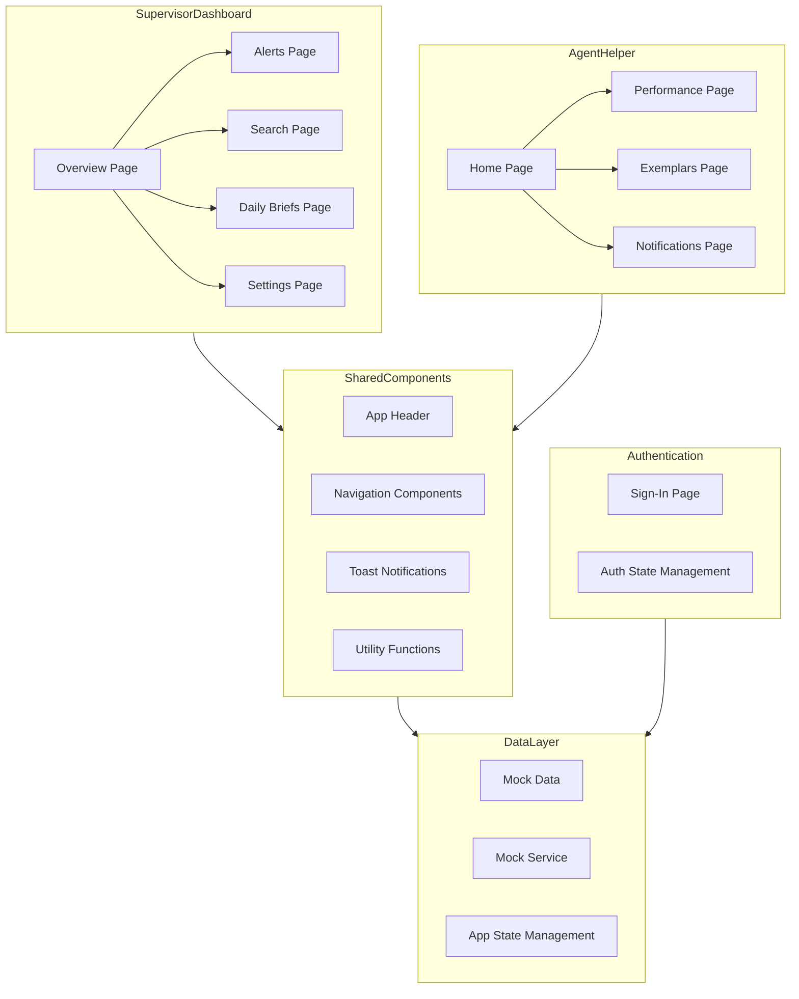

    

    <b>Automatic Architecture Diagrams from Code</b> 
    <a href="https://github.com/swark-io/swark">GitHub</a> • <a href="https://swark.io">Website</a> • <a href="mailto:contact@swark.io">Contact Us</a>

## Usage Instructions

1. **Render the Diagram**: Use the links below to open it in Mermaid Live Editor, or install the [Mermaid Support](https://marketplace.visualstudio.com/items?itemName=bierner.markdown-mermaid) extension.
2. **Recommended Model**: If available for you, use `claude-3.5-sonnet` [language model](vscode://settings/swark.languageModel). It can process more files and generates better diagrams.
3. **Iterate for Best Results**: Language models are non-deterministic. Generate the diagram multiple times and choose the best result.

## Generated Content
**Model**: GPT-4o - [Change Model](vscode://settings/swark.languageModel)  
**Mermaid Live Editor**: [View](https://mermaid.live/view#pako:eNqFlM1OwzAMx18lypm9wA5Ig4KGxJdUOKU7mNZtI9qkysdgQrw7SZNu6SjisMTOz8nfdtJ90VJWSNe0EI2CoSUvWSEI0fYtuLkdUO25lioD3b5JUJXnhDzt_Tp-sMkgz9DgLsBNh8poFqYU5AiqbFmYUnClONaaZcC7Q3Tm-4zhotFsMlJ4zGC1uozSCyBoLoCgtrgjaHmEwtU968ymQWG22Ln-hL1b2SPzQ5rbM6paqh5EiSyx05CbT-yHDpRmRyvFj9LwmpdguBSazbw0bBT2WScqZ-R4_Nn67MzlYvMWFFbXsh-kcGXHEzbDsEWoUDFnkWBOWcOeuR9vxlPJaWfkLxK0YeM414_81fBOMz9ycyC3VpQn-ju9DAzcw2G6iQdZvvsl5o0R7k4g9zfsbmNk0dkd68mNVDiWkxswSB5AuB73LvM_pDfWtI7G9ONr5Y24E8xPqzsx-zBcdJRw1j8aC99eeJcLl5G8xj9jztfGwFnr5sWcc3pBe3Qvi1fu_-KroC62x4KuSUErrMF2pqDfLsgOlSsr4-A61NO1URYvKFgj84MoJ19J27R0XUOn8fsHBsCQxg) | [Edit](https://mermaid.live/edit#pako:eNqFlM1OwzAMx18lypm9wA5Ig4KGxJdUOKU7mNZtI9qkysdgQrw7SZNu6SjisMTOz8nfdtJ90VJWSNe0EI2CoSUvWSEI0fYtuLkdUO25lioD3b5JUJXnhDzt_Tp-sMkgz9DgLsBNh8poFqYU5AiqbFmYUnClONaaZcC7Q3Tm-4zhotFsMlJ4zGC1uozSCyBoLoCgtrgjaHmEwtU968ymQWG22Ln-hL1b2SPzQ5rbM6paqh5EiSyx05CbT-yHDpRmRyvFj9LwmpdguBSazbw0bBT2WScqZ-R4_Nn67MzlYvMWFFbXsh-kcGXHEzbDsEWoUDFnkWBOWcOeuR9vxlPJaWfkLxK0YeM414_81fBOMz9ycyC3VpQn-ju9DAzcw2G6iQdZvvsl5o0R7k4g9zfsbmNk0dkd68mNVDiWkxswSB5AuB73LvM_pDfWtI7G9ONr5Y24E8xPqzsx-zBcdJRw1j8aC99eeJcLl5G8xj9jztfGwFnr5sWcc3pBe3Qvi1fu_-KroC62x4KuSUErrMF2pqDfLsgOlSsr4-A61NO1URYvKFgj84MoJ19J27R0XUOn8fsHBsCQxg)

